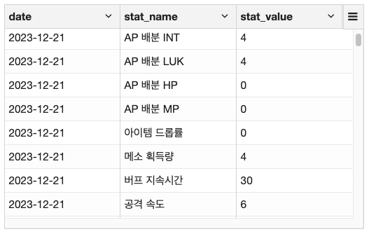
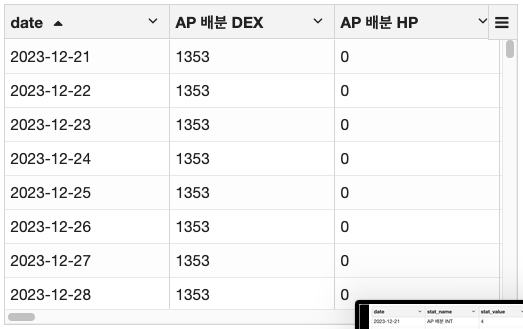

# 스파크에서 데이터프레임 전처리
## 옵션
`spark.read.option()`의 옵션들을 본다
```
%pyspark
df = spark.read.option('multiLine', True)\
    .option('inferSchema', True)\
    .option('encoding', 'utf-8')\
    .json('file:///경로/*.json)
```
### multiLine
- Spark는 각 줄을 하나의 완전한 JSON 객체로 간주함
```
[
  {
    "stat_name": "최소 스탯공격력",
    "stat_value": "17808205",
    "date": "2024-01-12"
  },
  {
...
..
.
]
```
- 그런데 tableau 분석하기 편하게 구조를 바꾸다 보니 위와 같은 구조가 된 상태이며 `spark.read()`의 기본값인 multiLine=False 상태에서는 여러 줄에 걸쳐 구성된 JSON을 잘라서 읽으므로 파싱에 실패
- 실패한 내용은 내부 필드인 _corrupt_record 컬럼에 저장됨
- df.show()는 _corrupt_record 외에 유효한 컬럼이 없기 때문에 에러 발생
- 그래서 멀티라인 옵션을 True로 넣어야 한다. 아래와 같이 된다

### inferSchema
## pivot
축을 바꾸는게 좋을거같아서 피벗 적용해보앗다
```
df_pivot = df.groupBy('date').pivot('stat_name').agg(first('stat_value')).orderBy('date')
```

