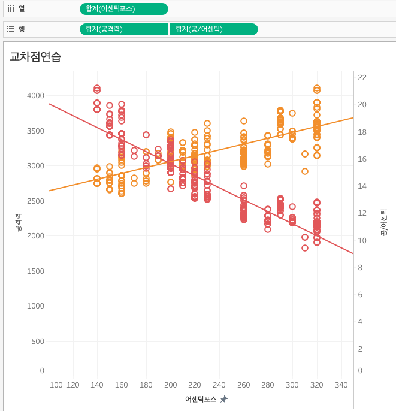
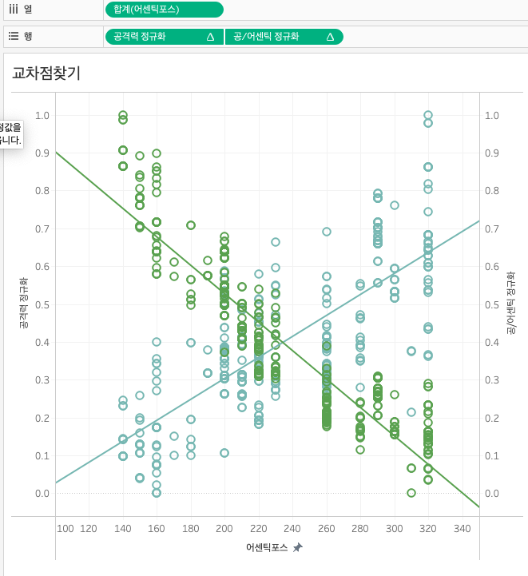

# 이중축
태블로에서 수요공급곡선같이 두 개의 선을 하나의 그래프에 시각화하고 싶다면 이중축을 사용할 수 있다

## 이중축 메뉴 출현조건
### 1.
열이나 행에 두 개의 측정값을 올려놓고
> 두번째 측정값 우클릭 > 이중축
### 2.
이중축으로 사용할 측정값을 먼저 만든 그래프의 우측사이드에 Drag&Drop
- 

## 정규화
이중축을 해놓고 보니까 스케일 정규화의 필요를 느꼈다. 정규화 공식에 따라 측정값을 정규화해보았다
> 태블로 사이드바 빈공간 우클릭 > 계산된 필드 만들기 > 수식 입력
```
(SUM([공격력]) - WINDOW_MIN(SUM([공격력]))) / (WINDOW_MAX(SUM([공격력])) - WINDOW_MIN(SUM([공격력])))
```
```
(SUM([공/어센틱]) - WINDOW_MIN(SUM([공/어센틱]))) / (WINDOW_MAX(SUM([공/어센틱])) - WINDOW_MIN(SUM([공/어센틱])))
```

## 테이블 계산 편집
정규화된 측정값을 행에 올려놓았더니 값이 모두 null로 인식되더라. 태블로에서 `WINDOW_` 함수를 사용했을 때에는 계산 대상(범위)을 지정해주어야 한다
- 정규화된 측정값을 열이나 행에 올려놓고
> 우클릭 > 테이블 계산 편집 > 계산 대상 선택 > 나의 경우 `Date`선택
- 
