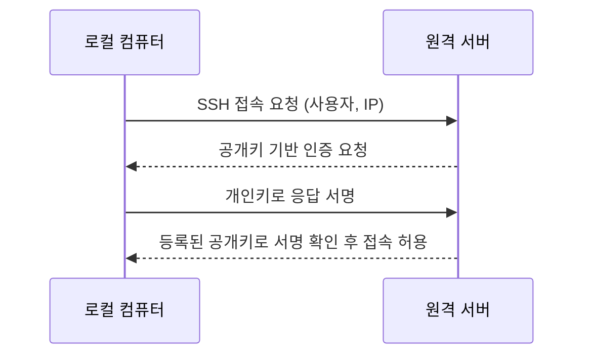

# TIL: SSH 설정 (2025-08-01)

## 날짜
- 2025-08-01

## 주제
- SSH 키를 이용한 원격 서버 접속 설정

## 개요
- 로컬 컴퓨터에서 원격 서버로 비밀번호 없이 안전하게 접속하기 위한 SSH 공개키/개인키 설정 과정 정리.
- 키 생성, 서버 등록, 접속 확인까지의 절차를 기록함.

## 주요 개념
- **SSH (Secure Shell)**
  - 원격지 컴퓨터에 안전하게 접속하고 명령을 실행하기 위한 보안 프로토콜.
  - 모든 통신 내용을 암호화하여 전송함.
- **공개키(Public Key) / 개인키(Private Key)**
  - 비대칭 암호화 방식에 사용되는 한 쌍의 키.
  - **개인키**: 클라이언트(로컬) 측에 저장, 외부에 노출되지 않도록 관리.
  - **공개키**: 서버(원격) 측에 등록, 개인키와 짝을 이루어 인증 수행.

## 설정 과정
- **1. SSH 키 생성 (로컬)**
  - `ssh-keygen` 명령어를 사용하여 공개키/개인키 쌍 생성.
  ```bash
  # -t: 키 타입(rsa, ed25519 등) 지정
  # -b: 키 비트 수(rsa의 경우 4096 권장) 지정
  # -C: 코멘트(주로 이메일) 추가
  ssh-keygen -t rsa -b 4096 -C "your_email@example.com"
  ```
  - 실행 후 `~/.ssh/` 디렉토리에 `id_rsa`(개인키), `id_rsa.pub`(공개키) 파일 생성 확인.

- **2. 공개키 복사 (서버)**
  - **방법 A: `ssh-copy-id` 사용 (권장)**
    - 원격 서버의 `~/.ssh/authorized_keys` 파일에 로컬 공개키를 자동으로 추가.
    ```bash
    ssh-copy-id [username]@[server_address]
    ```
  - **방법 B: 수동 복사**
    - 로컬의 `id_rsa.pub` 파일 내용을 복사.
    - 원격 서버에 접속하여 `~/.ssh/authorized_keys` 파일에 직접 붙여넣기.

- **3. 접속 확인**
  - 설정 완료 후, 아래 명령어로 비밀번호 입력 없이 접속되는지 최종 확인.
  ```bash
  ssh [username]@[server_address]
  ```

## 네트워크 구성도 (SSH 접속)
- Mermaid 시퀀스 다이어그램으로 표현.


## 트러블슈팅 및 참고사항
- **파일/디렉토리 권한 문제**
  - SSH는 보안상 엄격한 권한 설정을 요구함.
  - `~/.ssh` 디렉토리: `700`
  - `~/.ssh/authorized_keys` 파일: `600`
  - 권한이 올바르지 않을 경우 인증 실패 가능.
- **[기타 트러블슈팅 및 참고사항 기록]**

## 결론
- SSH 키 기반 인증 설정으로 서버 접속 시 편의성 및 보안성 크게 향상됨.
- `ssh-copy-id` 도구를 활용하면 설정 과정을 매우 효율적으로 단축 가능함을 확인.